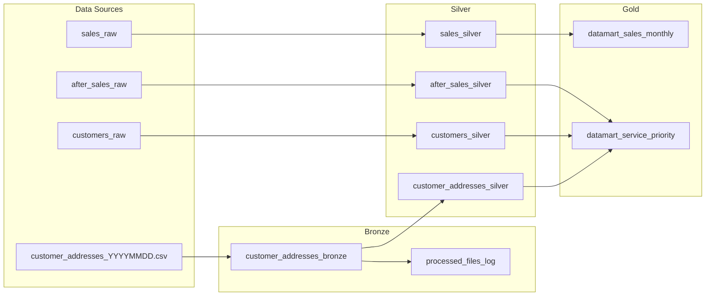
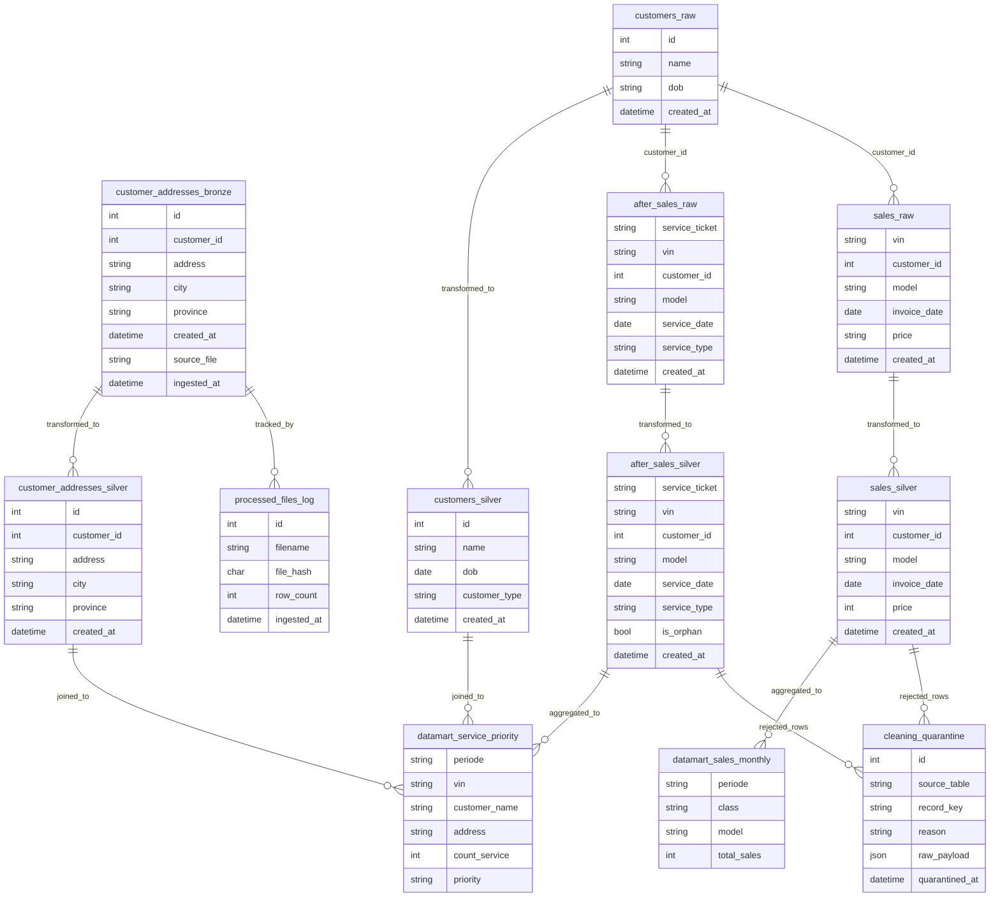

# Maju Jaya Data Warehouse

Medallion-architecture data warehouse built with Dagster + MySQL.

---

## Table of Contents

- [Overview](#overview)
- [Technical Test Mapping](#technical-test-mapping)
- [Architecture Diagram](#architecture-diagram)
- [Mermaid ERD](#mermaid-erd)
- [Tech Stack](#tech-stack)
- [Project Structure](#project-structure)
- [Layer Responsibilities](#layer-responsibilities)
- [Setup and Installation](#setup-and-installation)
- [How to Run](#how-to-run)
- [Generate Dummy Data](#generate-dummy-data)
- [Data Quality Rules](#data-quality-rules)
- [Transformation Details](#transformation-details)
- [Datamart Definitions](#datamart-definitions)
- [Notes](#notes)

---

## Overview

This repository implements a complete medallion data pipeline for the Maju Jaya automotive (Fictitious company) retail case:

- **Bronze** ingests daily `customer_addresses_YYYYMMDD.csv` files into MySQL.
- **Silver** cleans and standardizes raw data from `customers_raw`, `sales_raw`, `after_sales_raw`, and bronze addresses.
- **Gold** builds reporting datamarts for monthly sales and yearly service priority.
- **Dagster** orchestrates assets, job, and schedule in Docker.

The project is designed to be rerunnable (idempotent) and auditable, with quarantine support for rejected records.

## Technical Test Mapping

| Technical Test Item | Implementation in This Repo |
| --- | --- |
| Task 1: ingest daily `customer_addresses_yyyymmdd.csv` to MySQL | `src/assets/bronze.py` + `sql/schema_bronze.sql` |
| Task 2a: clean existing raw tables | `src/assets/silver.py` + `sql/schema_silver.sql` + `cleaning_quarantine` |
| Task 2b: build 2 report tables (daily job) | `src/assets/gold.py` + `sql/schema_gold.sql` |
| Task 3: DWH design from raw to datamart | Mermaid architecture + ERD in this README, plus exported diagrams in `docs/` |
| Optional: docker-compose environment | `docker-compose.yml`, `Dockerfile`, `.env.example` |

## Architecture Diagram



## Mermaid ERD



## Tech Stack

| Component | Choice | Reason |
| --- | --- | --- |
| Orchestrator | Dagster | Asset-based pipeline design with scheduling and observability |
| Database | MySQL 8 | Matches technical test requirement |
| Language | Python 3.11 | Core ETL transformations and orchestration code |
| Data processing | pandas | Fast tabular cleaning and schema handling |
| DB layer | SQLAlchemy + PyMySQL | Stable MySQL connectivity from Python |
| Containerization | Docker + Docker Compose | Reproducible local environment |

## Project Structure

```text
etl-pipeline/
├── src/
│   ├── assets/
│   │   ├── bronze.py
│   │   ├── silver.py
│   │   └── gold.py
│   ├── jobs/
│   │   └── daily_pipeline.py
│   ├── resources/
│   │   ├── config.py
│   │   └── mysql_resource.py
│   └── definitions.py
├── sql/
│   ├── seed_raw_tables.sql
│   ├── schema_bronze.sql
│   ├── schema_silver.sql
│   └── schema_gold.sql
├── scripts/
│   └── generate_dummy_data.py
├── data/
│   ├── input/
│   └── archive/
├── docs/
│   ├── architecture_diagram.png
│   └── erd_diagram.png
├── docker-compose.yml
├── Dockerfile
├── requirements.txt
└── README.md
```

## Layer Responsibilities

| Layer | Purpose | Main Files |
| --- | --- | --- |
| Bronze | Raw ingest from daily CSV + processing log | `src/assets/bronze.py`, `sql/schema_bronze.sql` |
| Silver | Data cleaning, standardization, flags, deduplication | `src/assets/silver.py`, `sql/schema_silver.sql` |
| Gold | Reporting datamarts for BI use cases | `src/assets/gold.py`, `sql/schema_gold.sql` |

## Setup and Installation

1. Copy env template:
   - `cp .env.example .env`
   - On Windows PowerShell: `Copy-Item .env.example .env`
2. (Optional) review `.env` values for MySQL and CSV directories.
3. Install dependencies if you want local (non-docker) execution:
   - `pip install -r requirements.txt`

## How to Run

### Docker (recommended)

1. Start all services:
   - `docker compose up --build -d`
2. Open Dagster UI:
   - `http://localhost:3000`
3. Materialize assets:
   - Run `daily_pipeline_job` from the Dagster UI.
4. Add daily CSV files:
   - Drop files named `customer_addresses_YYYYMMDD.csv` into `data/input/`.

To stop services:

- `docker compose down` (keep DB volume/data)
- `docker compose down -v` (remove DB volume/data)

### Local (without Docker, optional)

You can run Dagster locally, but Docker is the primary path used by this project.

## Generate Dummy Data

You can generate fresh sample raw SQL + daily address CSV files with:

```bash
python scripts/generate_dummy_data.py
```

This script:

- rewrites `sql/seed_raw_tables.sql` with deterministic dummy data,
- creates/refreshes `data/input/customer_addresses_20260328.csv`,
  `data/input/customer_addresses_20260329.csv`, and
  `data/input/customer_addresses_20260330.csv`,
- keeps values aligned with the cleaning rules in the silver layer.

Use this before running the pipeline if you want a clean reproducible demo dataset.

## Data Quality Rules

| Layer | Table | Rule |
| --- | --- | --- |
| Bronze | `customer_addresses_bronze` | Schema validation (column check) before ingest |
| Bronze | `processed_files_log` | SHA-256 content hash detects same-filename corrections; true duplicates skipped and cleaned from input |
| Silver | `customers_silver` | DOB parsed from mixed formats; sentinel `1900-01-01` and implausible dates → NULL |
| Silver | `customers_silver` | Entity type: CORPORATE (PT/CV/UD prefix + NULL DOB) vs INDIVIDUAL |
| Silver | `sales_silver` | Price: strip IDR thousand-separator dots, cast to integer |
| Silver | `sales_silver` | Future `invoice_date` → quarantined |
| Silver | `sales_silver` | Unknown `customer_id` → quarantined |
| Silver | `sales_silver` | Deduplication by VIN (globally unique vehicle identifier); keep earliest `created_at` |
| Silver | `after_sales_silver` | `service_date` before `invoice_date` → quarantined |
| Silver | `after_sales_silver` | Future `service_date` → quarantined |
| Silver | `after_sales_silver` | Unknown `customer_id` → quarantined |
| Silver | `after_sales_silver` | VIN not in `sales_silver` → flagged `is_orphan = TRUE` (not quarantined) |
| Silver | `customer_addresses_silver` | City/province normalized to Title Case; known abbreviations (DKI, DI) corrected |
| Silver | `customer_addresses_silver` | Province corrected for mis-mapped cities (e.g. Tangerang Selatan → Banten) |
| Gold | `datamart_sales_monthly` | Only price ≥ 100,000,000 included; sub-100M records excluded |
| Gold | `datamart_service_priority` | Only `is_orphan = FALSE` service records counted |

## Transformation Details

### Bronze Asset: `customer_addresses_bronze`

Pipeline behavior for each file matching `customer_addresses_YYYYMMDD.csv`:

1. Compute `SHA-256` hash from file bytes.
2. Check `processed_files_log` by `filename`.
3. If filename exists and hash is same:
   - skip ingest (true duplicate),
   - keep database unchanged,
   - remove file from `data/input` (move/delete depending on archive state).
4. If filename exists but hash is different:
   - treat as corrected file,
   - delete prior bronze rows for that `source_file`,
   - re-ingest current file,
   - update `processed_files_log` with new `file_hash`, `row_count`, and `ingested_at`.
5. Validate CSV columns before insert:
   - expected: `id, customer_id, address, city, province, created_at`.
6. Append metadata columns:
   - `source_file` = CSV filename,
   - `ingested_at` = UTC ingest timestamp.
7. Archive successfully handled files to `data/archive`.

### Silver Asset: `customers_silver`

Transformations applied:

- Parse mixed DOB formats (`YYYY-MM-DD`, `YYYY/MM/DD`, `DD/MM/YYYY`).
- Convert invalid DOB cases to `NULL`:
  - sentinel `1900-01-01`,
  - parse errors,
  - future dates,
  - implausible year (< 1925).
- Classify customer type:
  - `CORPORATE` if name starts with corporate prefix (`PT`, `CV`, `UD`, etc.) and DOB is null,
  - otherwise `INDIVIDUAL`.
- Output table refreshed with `TRUNCATE + INSERT`.

### Silver Asset: `sales_silver`

Transformations applied:

- Normalize `price`:
  - remove IDR thousand separators (`.`),
  - convert to integer type.
- Parse `invoice_date` and `created_at` to datetime-compatible values.
- Quarantine and drop rows when:
  - `invoice_date` is in the future,
  - `customer_id` does not exist in `customers_raw`,
  - `price` cannot be parsed.
- Deduplicate on VIN:
  - `vin` (globally unique vehicle identifier),
  - keep earliest `created_at`.
- Output table refreshed with `TRUNCATE + INSERT`.

### Silver Asset: `after_sales_silver`

Transformations applied:

- Quarantine and drop rows when:
  - `customer_id` not found in `customers_silver`,
  - `service_date` in the future,
  - `service_date` earlier than corresponding vehicle `invoice_date` (non-orphan VINs only).
- Set orphan indicator:
  - `is_orphan = TRUE` if `vin` not found in `sales_silver`,
  - orphan VINs skip the service_date vs invoice_date check because no invoice exists,
  - retained for downstream filtering.
- Output table refreshed with `TRUNCATE + INSERT`.

### Silver Asset: `customer_addresses_silver`

Transformations applied:

- Normalize text casing:
  - `city` and `province` converted to title case.
- Fix Indonesian province abbreviations after title-case conversion:
  - e.g. `Dki Jakarta` -> `DKI Jakarta`, `Di Yogyakarta` -> `DI Yogyakarta`.
- Apply city-based province correction overrides:
  - e.g. `Tangerang Selatan` -> `Banten`.
- Keep address history (multiple rows per `customer_id` are expected).
- Output table refreshed with `TRUNCATE + INSERT`.

### Gold Asset: `datamart_sales_monthly`

- Build monthly aggregate from `sales_silver`.
- Derive class buckets:
  - `LOW` (100M-250M),
  - `MEDIUM` (250M+1 to 400M),
  - `HIGH` (>400M).
- Exclude prices below 100M.
- Aggregate to `SUM(price)` by `periode`, `class`, and `model`.

### Gold Asset: `datamart_service_priority`

- Join `after_sales_silver`, `customers_silver`, and latest record from `customer_addresses_silver`.
- Use `ROW_NUMBER()` windowing to pick latest address per customer.
- Count services per year and VIN.
- Derive priority:
  - `HIGH` (>10),
  - `MED` (5-10),
  - `LOW` (<5).
- Exclude orphan service rows (`is_orphan = FALSE`).

## Datamart Definitions

### 1) `datamart_sales_monthly`

Output columns:

- `periode` (`YYYY-MM`)
- `class` (`LOW`, `MEDIUM`, `HIGH`)
- `model`
- `total_sales` (SUM of price)

Classification:

- `LOW`: 100,000,000 to 250,000,000
- `MEDIUM`: 250,000,001 to 400,000,000
- `HIGH`: above 400,000,000

### 2) `datamart_service_priority`

Output columns:

- `periode` (`YYYY`)
- `vin`
- `customer_name`
- `address` (latest address per customer)
- `count_service`
- `priority` (`HIGH`, `MED`, `LOW`)

Priority rules:

- `HIGH`: service count > 10
- `MED`: service count between 5 and 10
- `LOW`: service count < 5

## Notes

- Bronze ingest is idempotent: `processed_files_log` tracks filename + SHA-256 hash. Same file content → skip + clean input dir. Same filename, different content → delete old bronze rows and re-ingest.
- Rejected rows are written to `cleaning_quarantine` with source table, record key, reason, and full JSON payload for audit.
- Silver address history is intentionally kept as-is (multiple rows per customer). Gold uses `ROW_NUMBER()` to resolve the latest address per customer at query time.
- Gold datamarts are rebuilt daily using `TRUNCATE + INSERT`.
- Schedule is configured for `01:00 UTC` in `src/jobs/daily_pipeline.py`.
- All internal timestamps use UTC. Convert to `Asia/Jakarta (WIB, UTC+7)` at the BI/reporting layer.
